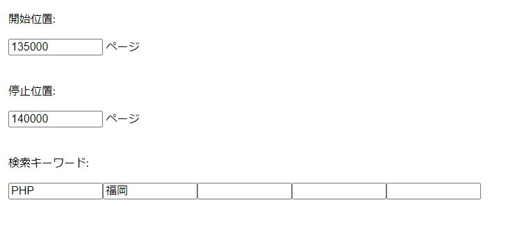

# 気になるボタン自動押下ツール for Green

求人ページに指定したキーワードが含まれている場合、そのページの気になるボタンを自動で押下するツールです。  
転職サイトGreenにて使用できます。

## 環境構築手順

1. 当ツールをダウンロード
2. Chromeを開いてchrome://extensions/にアクセス
3. 右上の[デベロッパー モード]をON
4. [パッケージ化されていない拡張機能を読み込む]をクリック
5. 当ツールを読み込む

## 使い方

1. Greenにアクセスしてログインを実行
2. 拡張機能のアイコンをクリック
3. ポップアップ上の歯車アイコンをクリック
4. 処理の開始位置を指定
5. 処理の停止位置を指定
6. 検索キーワードを指定
7. スイッチON
8. Greenにてページリロード等を行うと処理が開始される

### (設定例)



上記のように設定した場合、

```http
# 135,000ページ目
https://www.green-japan.com/job/135000?case=tlogin
```

から

```http
# 140,000ページ目
https://www.green-japan.com/job/140000?case=tlogin
```

までを1ページずつ表示していきます。  
ページが表示されたとき、  
そのページのメインコンテンツに「PHP」「福岡」という文字列が両方とも含まれているなら、  
そのページの気になるボタンを押下します。

## その他

- 5秒に1回の頻度で次のページへ移動します。
- 検索キーワードを指定しない場合、移動する全てのページで気になるボタンを押下します。
- 処理をやめる場合はスイッチをOFFにしてください。
